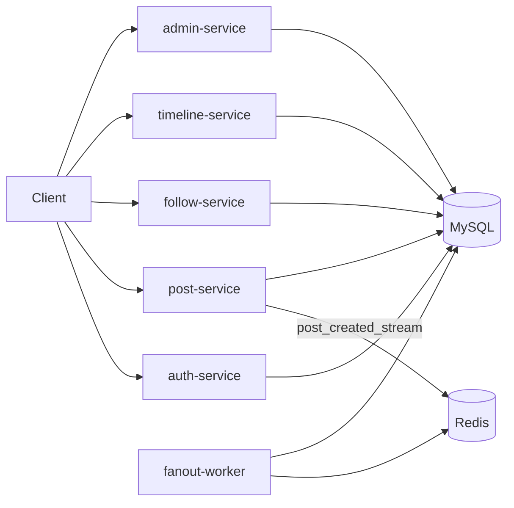

# Whisper Backend

Whisper is a Go microservices backend for timeline social posting. Services: auth (8083), post (8081), follow (8085), timeline (8082), fanout worker, and admin (8086).

## Architecture

## Admin Service

Admin endpoints require a JWT with `role=admin`:
- `GET /admin/users`
- `GET /admin/users/:userId`
- `PATCH /admin/users/:userId` (`status`: active/deactivated/restricted)
- `GET /admin/posts`
- `GET /admin/posts/:postId`
- `DELETE /admin/posts/:postId`
- `GET /admin/stats`

Status semantics:
- `deactivated`: cannot log in; posts hidden from timeline/feed queries.
- `restricted`: can log in but cannot create new posts.

## Local run (Docker)

1. `cp .env.example .env`
2. set `JWT_SECRET` and DB credentials
3. `docker compose up --build`

## Local run (without Docker)

Run each service from its folder, e.g. `go run cmd/main.go`.

## API docs

OpenAPI spec: `api/openapi.yaml`.
