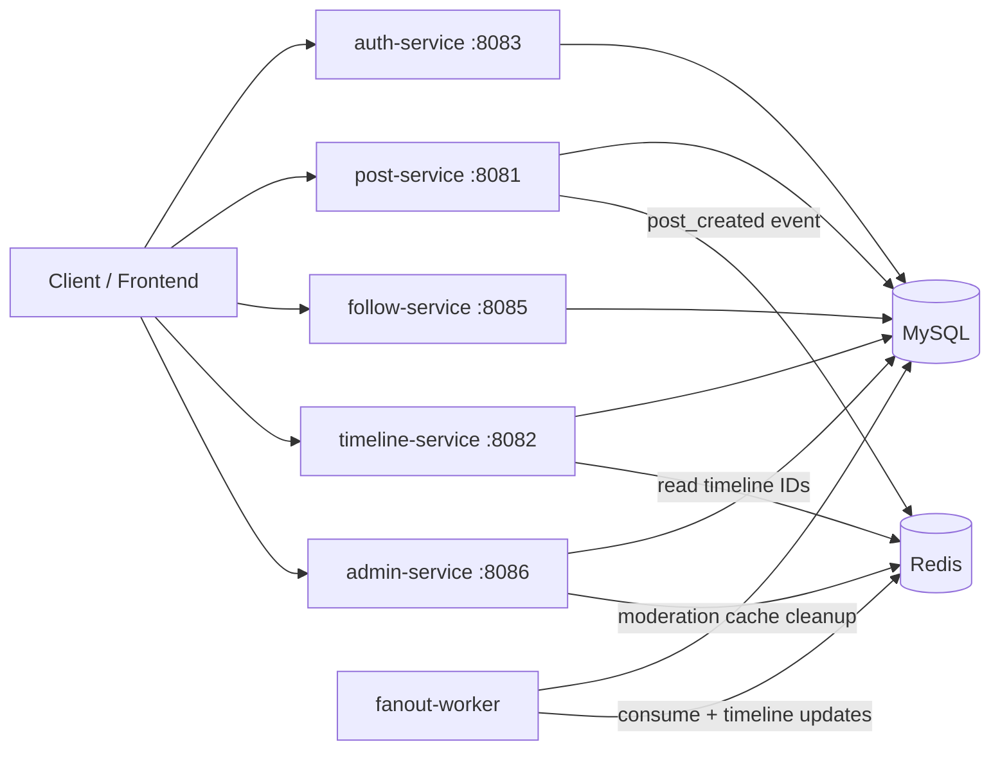

# Whisper Backend

A production-oriented, event-driven Go microservices backend for a social timeline platform.

Whisper supports:
- User registration and authentication (JWT)
- Post creation and asynchronous timeline fanout
- Follow/unfollow social graph operations
- Timeline read APIs
- Admin moderation APIs (users, posts, and basic analytics)

---

## Table of Contents

- [System Overview](#system-overview)
- [Architecture](#architecture)
- [Services](#services)
- [Data Model](#data-model)
- [Event Flow](#event-flow)
- [Repository Structure](#repository-structure)
- [Local Development](#local-development)
- [Docker Development](#docker-development)
- [Configuration](#configuration)
- [API Overview](#api-overview)
- [Admin Workflows](#admin-workflows)
- [Testing](#testing)
- [Observability & Operations](#observability--operations)
- [Security Notes](#security-notes)
- [Roadmap / Suggested Improvements](#roadmap--suggested-improvements)

---

## System Overview

Whisper is designed as a set of independent services sharing MySQL for persistent data and Redis for:
- stream processing (`post_created_stream`) and
- timeline cache/indexing (`timeline:{userID}` ZSET keys).

The core write path is event-driven: posts are persisted first, then distributed to followers asynchronously by the fanout worker.

---

## Architecture



### Design Principles

- **Microservices by capability**: auth, post, follow, timeline, admin, worker
- **Layered internal design**: adapters/drivers, usecases, ports
- **Async fanout**: stream-based decoupling between post writes and timeline distribution
- **Shared infrastructure package**: DB, Redis, middleware, JWT, security helpers in `shared/`

---

## Services

### 1) `auth-service` (`:8083`)

Responsibilities:
- Register new users
- Authenticate users and issue JWT access tokens
- Basic user profile updates

Key behavior:
- User model includes `role` and `status`
- Registration defaults: `role=user`, `status=active`
- Login blocks users with `status=deactivated`
- JWT includes `user_id`, `email`, `role`, and token metadata

---

### 2) `post-service` (`:8081`)

Responsibilities:
- Create new posts (“wispers”)
- Persist posts to MySQL
- Publish `post_created` events to Redis stream for fanout

Key behavior:
- Rejects empty/too-long post bodies
- Blocks post creation for users with `status=deactivated` or `status=restricted`
- Posts support soft delete via GORM deleted timestamp

---

### 3) `follow-service` (`:8085`)

Responsibilities:
- Follow / unfollow operations
- Relationship checks and stats
- Feed query over followed users

Key behavior:
- Feed query excludes soft-deleted posts
- Feed query only returns posts authored by users in `active` status

---

### 4) `timeline-service` (`:8082`)

Responsibilities:
- Return user timeline data
- Read post IDs from Redis timeline ZSET
- Hydrate post details from MySQL

Key behavior:
- Timeline query path excludes soft-deleted posts
- Timeline query path only returns posts by `active` users
- Includes per-user request limiting middleware

---

### 5) `fanout-worker` (background)

Responsibilities:
- Consume `post_created_stream`
- Resolve followers of post author
- Push post IDs into each follower timeline sorted set in Redis

Key behavior:
- Decouples write latency from follower distribution work
- Supports graceful shutdown hooks in worker process lifecycle

---

### 6) `admin-service` (`:8086`)

Responsibilities:
- Admin-only moderation and management APIs
- User status management
- Post retrieval/deletion moderation
- Basic system statistics

Key behavior:
- Protected by JWT auth + role middleware (`admin` required)
- `PATCH /admin/users/{userId}` supports status transitions:
  - `active`
  - `deactivated`
  - `restricted`
- `DELETE /admin/posts/{postId}` soft-deletes post and removes post ID from relevant Redis timelines

---

## Data Model

### `users`

Main fields:
- `id`
- `email` (unique)
- `password` (bcrypt hash)
- `role` (`user` | `admin`)
- `status` (`active` | `deactivated` | `restricted`)
- timestamps

### `posts`

Main fields:
- `id`
- `author_id`
- `content`
- `created_at`
- `deleted_at` (soft delete)

### `followers`

Main fields:
- `id`
- `user_id` (followee)
- `follower_id` (follower)
- unique composite relation

---

## Event Flow

### Post Creation to Timeline Delivery

1. Client sends `POST /posts` with JWT.
2. `post-service` validates user status and persists post to MySQL.
3. `post-service` publishes to Redis stream (`post_created_stream`).
4. `fanout-worker` consumes event.
5. Worker loads follower IDs and updates each `timeline:{userID}` ZSET.
6. `timeline-service` reads IDs + hydrates posts for timeline reads.

### Moderation Flow (Admin)

1. Admin sends `DELETE /admin/posts/{postId}`.
2. Post is soft-deleted in MySQL.
3. Service removes post ID from follower timeline ZSET keys and author timeline key.
4. Read APIs also defensively filter deleted/ineligible content.

---

## Repository Structure

```text
.
├── admin-service/
├── auth-service/
├── post-service/
├── follow-service/
├── timeline-service/
├── fanout-worker/
├── notification-service/        # present in repository; currently not part of core compose stack
├── shared/                      # common config/middleware utilities
├── api/                         # OpenAPI specification
├── docs/                        # integration/frontend docs
├── scripts/                     # smoke/demo/load scripts
├── docker-compose.yml
├── go.work
└── RUNBOOK.md
```

---

## Local Development

### Prerequisites

- Go (workspace version compatible with modules)
- MySQL 8+
- Redis 7+
- GNU Make (optional)

### 1) Configure environment

```bash
cp .env.example .env
```

Edit `.env` with local values (`DB_*`, `REDIS_*`, `JWT_SECRET`, etc.).

### 2) Start infrastructure

Use local MySQL + Redis (or Docker for just infra).

### 3) Run services (separate terminals)

```bash
cd auth-service && go run cmd/main.go
cd post-service && go run cmd/main.go
cd follow-service && go run cmd/main.go
cd timeline-service && go run cmd/main.go
cd fanout-worker && go run cmd/main.go
cd admin-service && go run cmd/main.go
```

### 4) Verify health

```bash
curl -i http://localhost:8083/health
curl -i http://localhost:8081/health
curl -i http://localhost:8085/health
curl -i http://localhost:8082/health
curl -i http://localhost:8086/health
```

---

## Docker Development

### Full stack

```bash
cp .env.example .env
docker compose up --build
```

Services started:
- mysql (`3306`)
- redis (`6379`)
- auth (`8083`)
- post (`8081`)
- follow (`8085`)
- timeline (`8082`)
- admin (`8086`)
- fanout-worker (background)

To stop:

```bash
docker compose down
```

To reset DB volume:

```bash
docker compose down -v
```

---

## Configuration

Core environment variables (see `.env.example`):

- `APP_PORT`
- `DB_HOST`, `DB_PORT`, `DB_USER`, `DB_PASSWORD`, `DB_NAME`
- `REDIS_HOST`, `REDIS_PORT`
- `JWT_SECRET`
- `RABBITMQ_HOST`, `RABBITMQ_PORT` (reserved / non-core in current compose)

> Notes:
> - Service-level `.env` files may override shared root values.
> - Ensure all services share the same `JWT_SECRET`.

---

## API Overview

Detailed API specification is available at:
- `api/openapi.yaml`

### Core endpoints (high level)

- Auth: `/register`, `/login`, `/update`
- Posts: `/posts`
- Follow: `/follow`, `/unfollow`, `/followers/:userId`, `/following/:userId`, `/is-following/:userId`, `/stats/:userId`, `/feed`
- Timeline: `/timeline`
- Admin: `/admin/users`, `/admin/posts`, `/admin/stats`, etc.

---

## Admin Workflows

### Grant admin role

```sql
UPDATE users SET role='admin' WHERE email='admin@example.com';
```

### Deactivate user

- Endpoint: `PATCH /admin/users/{userId}` body `{"status":"deactivated"}`
- Effect:
  - user cannot log in
  - user posts are filtered out from timeline/feed query paths

### Restrict user

- Endpoint: `PATCH /admin/users/{userId}` body `{"status":"restricted"}`
- Effect:
  - user can authenticate
  - user cannot create new posts

### Delete post

- Endpoint: `DELETE /admin/posts/{postId}`
- Effect:
  - post soft-deleted
  - timeline cache entries removed from Redis

---

## Testing

Run tests per service:

```bash
cd shared && go test ./...
cd auth-service && go test ./...
cd post-service && go test ./...
cd follow-service && go test ./...
cd timeline-service && go test ./...
cd fanout-worker && go test ./...
cd admin-service && go test ./...
```

Smoke scripts are available under `scripts/` for end-to-end checks.

---

## Observability & Operations

- Operational procedures: see `RUNBOOK.md`
- Health endpoints available on HTTP services (`/health`)
- Logs are emitted per service; centralize via your preferred platform in production

Production recommendations:
- structured centralized logging
- metrics export (Prometheus/OpenTelemetry)
- distributed tracing across service boundaries
- dashboards and SLO/SLA tracking

---

## Security Notes

- JWT auth required for protected endpoints
- Admin APIs require `role=admin`
- Use strong `JWT_SECRET` and rotate periodically
- Prefer TLS termination at ingress/reverse proxy
- Apply network policies and least-privilege DB credentials

---

## Roadmap / Suggested Improvements

- Dedicated migration tooling (instead of only auto-migrate patterns)
- Better cross-service contracts (versioned events, schema validation)
- Stronger integration test suite and test containers
- Full OpenAPI split per service with generated client SDKs
- Unified config package and stricter validation on startup

---

If you are onboarding frontend or platform teammates, start with:
1) `api/openapi.yaml`
2) `RUNBOOK.md`
3) service folders for route/usecase implementations.
